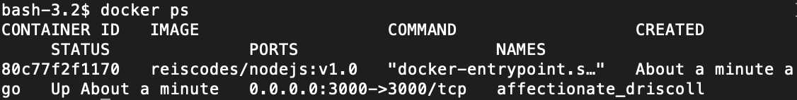
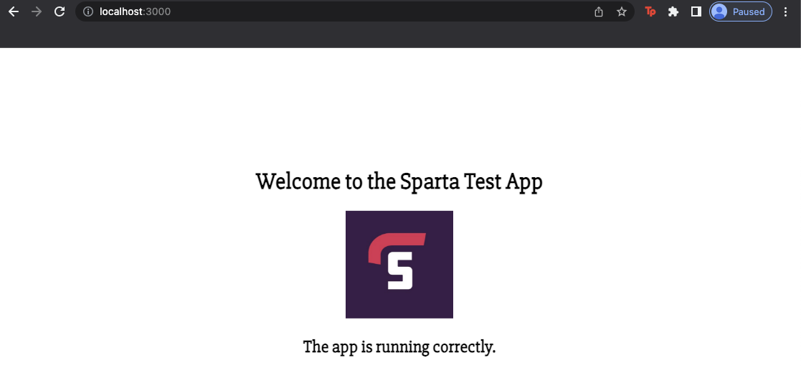
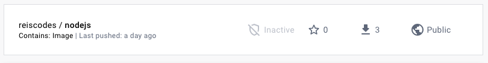
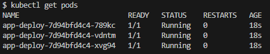
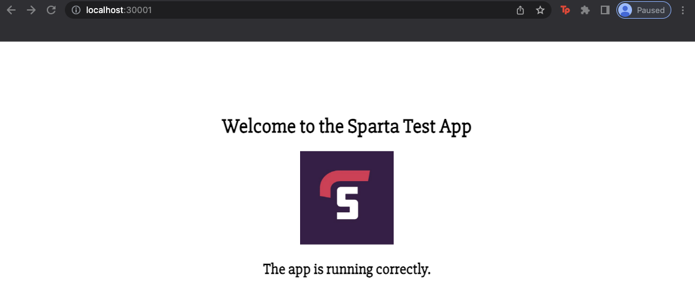

# Using Docker and Kubernetes to Deploy Sparta App locally 

## Creating Docker image of the Sparta App 

<b>Prerequisite:</b> 
  - Ensure you have Docker Desktop downloaded and running - https://www.docker.com/products/docker-desktop/
  - Ensure you have an account on DockerHub - https://hub.docker.com/
  - Make sure within your DockerDesktop, Kubernetes is `Enabled` and running.
<br>

1. Ensure your PWD is where the app folder is located. 

<br>

2. Within the same directory create a `Dockerfile`. This file will include all the information neccesary to create a Docker image, which is a read-only template that defines how a container will be realized. 

```
sudo nano Dockerfile
```

3. Within this file add the following information. This defines which base image from Dockerhub we would like to use, creating a directory where we want to store the nodejs app and to copy it to this destination. Also includes information on who maintains this Docker image, The port we need to expose to be able to view our application and the commands to launch it within the container. 

```
# base image Node
FROM node:16

# Create app directory
WORKDIR /app

# Who is the owner
LABEL MAINTAINER=Reis-Pinnock

# Copy app to work dir
COPY app/ .

# use port 3000
EXPOSE 3000

# install npm
RUN npm install

# excecute commands
CMD ["npm", "start", "daemon off;"]
```

Once copied save the file with `Ctrl` + `X`, `Y` and `Enter`.

4. To create the Docker image locally we can run the command. 

```
docker build -t <Dockerhub_acc_name>/<repo_name>:<tag> .
```

In my case this was 

```
docker build -t reiscodes/nodejs:v1.0 .
```

5. Once this is created we can create and deploy the Docker container locally to test its working with 

```
docker run -d -p 3000:3000 <Dockerhub_acc_name>/<repo_name>:<tag> .
```

Can verify its running by navigating on your browser to - localhost:3000.



6. To get the container ID, use the command

```
docker ps
```



Then to stop the container running use `docker stop <container_ID>`

7. Now push the local image to DockerHub so it can be accessed by the Docker community. You can either create a directory with the same name or pushing it will create a repo for you with the name you have defined. 

```
docker push <Dockerhub_acc_name>/<repo_name>:<tag>
```



## Using Kubernetes to use Docker image to deploy Sparta App 

1. First thing we need to do is create a deployment file, using VSC makes this easier, name the file `app-deploy.yml` this file acts as configeration file. 

```
# which api to use for deployment
apiVersion: apps/v1 

# what kind of service/object do you want to create?
kind: Deployment 

metadata:
  name: app-deploy # what would you like to call it - name the service/object
spec:
  selector: 
    matchLabels:
      app: node
  replicas: 3

  template:
    metadata:
      labels:
        app: node
    
    spec: 
      containers:
      - name: node
        image: reiscodes/nodejs:v1.0  # Determine which Docker image to use 
        ports:
        - containerPort: 80
```

2. Now on the terminal within the same directory of the deployment file we can create it with the following command:

```
kubectl create -f app-deploy.yml
```

3. We can see the deploment with:

```
kubectl get deploy
```



And to see each individual pod

```
kubectl get pods
```


4. Although we have created the deployment if we go to `localhost:3000` we wont see the app deployed, this is because we need to expose this deployment with a service. So create a file `app-service.yml`, this will have configeration on how to make this deployement accessible. 

```
# Select the type of API version and type of service/object
apiVersion: v1

# what kind of service/object do you want to create?
kind: Service

# Metadata for name
metadata:
  name: node-svc
  namespace: default #sre
# Specification to include ports Selector to connect to the app
spec:
  ports:
  - nodePort: 30001 # range is 30000-32768
    port: 3000


    targetPort: 3000

  # lets define the selector and label to connect to node deploment
  selector:
    app: node 

  # Creating NodePort type of deployement 
  type: NodePort 
  ```

5. Again to actually create the service use

```
kubectl create -f service-deploy.yml
```

6. As Kubernetes port range is 30000-32768 and we have chosen to use port 30001 to connect to our app running on port 3000, navigating on our browser to `localhost:30001` we can see the sparta app deployed locally on our Kubernetes cluster using the Docker image created previously. 



<br>

7. We can delete the Service and Deployment with 

``` 
kubectl delete -f . 
```


